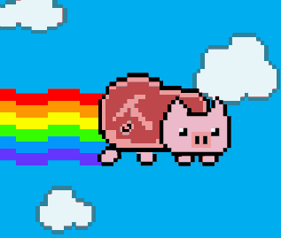

# Pig-Game 🐖

### Welcome to my Pig-Game project! 👋🏻 

This is just a simple website which I made for learning purposes. Here are the rules for the game 📄

* Each player takes turns rolling the dice.
* If the player rolls a ` 1 `, they score **nothing** and it becomes the *next player's turn*.
- If the player rolls **any other number**, it is *added* to their turn total and the player's turn *continues*.
- If a player chooses to **"hold"**, their turn total is added to their score, and it becomes the next player's turn.

### developed using 👇🏻
* ✅ HTML 
* ✅ CSS
* ✅ JS

Enjoy playing! 🎉
